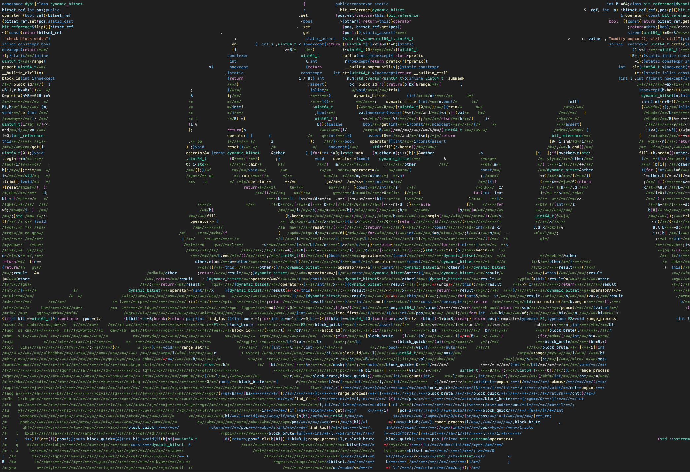

(AI-Generated readme below)

# Waifufy: C++ → ASCII Art

A C++ tool that formats C++ programs to visually approximate ASCII art while preserving program semantics.

## Features
- **Advanced DP Layout Engine**: 3D dynamic programming for optimal token/comment/space placement
- **Scarcity-Aware Budgeting**: Prevents token starvation by monitoring usage rates across rows
- **Randomized Diversity**: Tie-breaking in DP transitions creates varied outputs
- **Smart Selection**: Relaxed scoring favors higher token density within quality bounds
- **Overflow Handling**: Natural line length variation for content beyond image bounds

## Core Components
- H, W and art density grid via `waifufy::parse_art_to_density()`
- ASCII char→density map (0/1) via `waifufy::default_ascii_density_01()` (vector-backed; size ≥ 128)
- Comment stripping and minimal C++ tokenizer via `strip_comments_preserve_literals()` and `tokenize_minimal_cpp()`
- Safe token join helpers: `needs_separator()`, `minimal_separator()`, `join_tokens_min_sep()`
- Full DP implementation in `convert_layout()` with state transitions and backtracking
- CLI `waifufy` to wire components together

## Build

```sh
cmake -S . -B build
cmake --build build -j
```

## Run

```sh
./build/waifufy \
  --code input_code.cpp \
  --art input_art.txt \
  --out output_code.cpp \
  --dump-meta
```

Optional parameters:
- `--width N` / `--height N`: Override dimensions (default: inferred from art)
- `--dump-meta`: Print width, height, and token count to stderr


## Layout Algorithm

The core `convert_layout()` in `src/waifufy_core.cpp` implements a sophisticated DP-based layout engine:

```cpp
std::string convert_layout(
    const std::vector<Token>& tokens,
    int W,
    int H,
    const std::vector<std::vector<double>>& target_density,
    const AsciiDensity& density_map);
```

### DP State Space
- **3D DP table**: `(i, j, k)` where:
  - `i`: column position (0 to W_BOUND-1)
  - `j`: tokens consumed (0 to tokens_left_total)
  - `k`: separator state (0=space, 1=comment, 2=needs_sep, 3=no_sep)

### Advanced Features
- **Scarcity budgeting**: Caps token usage per row when projection indicates early exhaustion
- **Randomized ties**: Equal-score transitions randomly update backpointers for diversity
- **Relaxed selection**: Prefers high token counts within `SCORE_RELAXATION` margin
- **Smart overflow**: Variable-width lines beyond image height with natural variation

### Key Parameters
- `MN_TOKENS = 4`: Minimum preferred tokens per row
- `SCORE_RELAXATION_FACTOR = 10`: Token count preference relaxation
- `MX_COMMENT_LENGTH = 20`: Maximum generated comment block length

## Helper Tools

### Image to Grid Conversion
```bash
python3 helper/img2grid.py input.jpg --width 300 --y-aspect 0.4 -o input_art.txt
```

Converts images to ASCII art grids with configurable dimensions and aspect ratios.

## Whitespace safety rules
Two tokens `a` then `b` need at least one space/comment/newline separator if any of the following holds:
- Alnum/underscore merge: last of `a` and first of `b` are `[A-Za-z0-9_]` → would merge into an identifier/number.
- Comment/close hazards: `a.endswith('/') and b.startswith('/')` (forms `//`), `a.endswith('/') and b.startswith('*')` (forms `/*`), or `a.endswith('*') and b.startswith('/')` (forms `*/`).
- Multi-char operators formed across boundary: `>>=, <<=, ->*, ::, ->, ++, --, <<, >>, &&, ||, ==, !=, <=, >=, +=, -=, *=, /=, %=, &=, |=, ^=, ##, ...`.
- Literal + identifier (UDL): string/char/number followed immediately by identifier or `_`.
- Floating literal adjacency: `.` next to digit across boundary or digit next to `.`.

Call `needs_separator(a, b)` to enforce these.

## Algorithm Enhancements

### Recent Improvements
- **Complete DP implementation**: Full 3D state space with optimal backtracking
- **Token distribution**: Automatic budgeting prevents starvation in later image rows
- **Layout diversity**: Randomized tie-breaking creates varied outputs across runs
- **Quality-density trade-off**: Configurable relaxation balances visual quality with token density
- **Natural overflow**: Variable-width handling for content beyond image boundaries

### Performance Optimizations
- Efficient state space pruning during DP transitions
- Pre-computed separator requirements for token sequences
- Optimized character-density lookup with vector-backed mapping
- Minimal memory allocation during layout reconstruction
